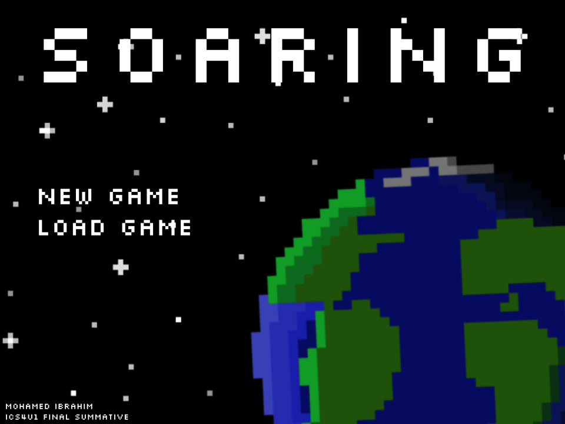

# Soaring

## Description
This is a remake of the once popular Flash game, [Flight](https://www.gameszap.com/game/6397/flight.html), created as a fun project.

## Screenshots
Include screenshots of your game to give users a visual idea of what to expect.




## Installation/Running the Game
1. Ensure prerequisites are met
2. Clone repository
3. Run the [Game.py](https://github.com/moibra05/Soaring/blob/main/Game.py) file

### Prerequisites

```bash
# Install Python (if not already installed)
https://www.python.org/downloads/

# Install Pygame
pip install pygame
